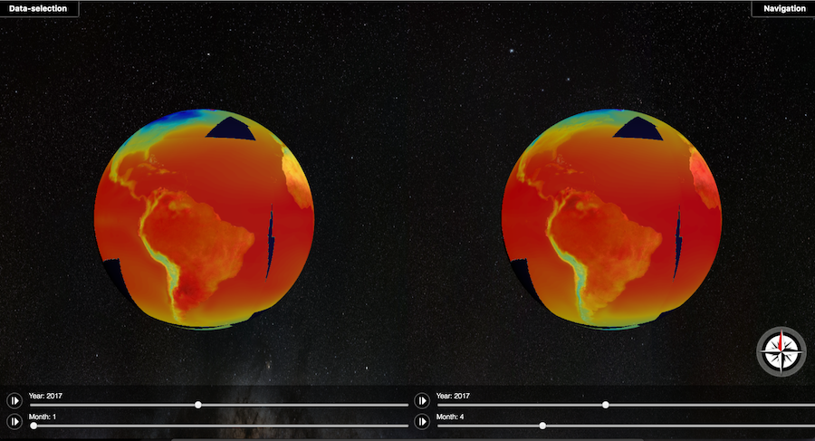
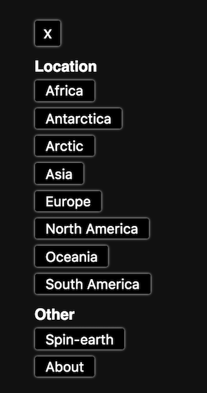

# WeatherMagic User Guide

This document helps getting to know the GUI of WeatherMagic, Weather-Front, better. 

## Landing page

The first thing you'll see when you open up the application is the landing page. This page describes what kind of site you've reached. Press any of the buttons "Temperature" or "Precipitation" in order to get to the main view of the application with data mapped onto the globes. 

## First look

When you first open up Weather-front, you see the earth with temperature data current year mapped onto it. Since the data models that WeatherMagic uses doesn't cover the entire earth - some areas of the earth does not show any data but instead just the map of the earth. 

From this view you can use different actions to move the earth freely. 

-   Spin the earth by grabbing it with the mouse and dragging it over the screen.
-   Zoom in into the view by scrolling on your mouse or trackpad with scrolling support.
-   Zoom in to a specific point on the earth by double clicking it.

You can also use the compass button  in order to align both of the globes.

The sliders at the bottom of the screen controls which year and month that is displayed in the two earths. By pushing the play/pause buttons in the bottom you can make the application work it's way through the years for the current climate model. 

By choosing to have two earths side-by-side - WeatherMagic allows you to compare the climate for different time periods within the same view. 

## Choosing what data to visualize - the Data panel

In order to choose what data to visualize, open the data panel by clicking the button "Data-selection" in the upper left corner of the screen. Here you can choose wether you wan't to see simulaiton values for temperature or precipitation - or just a plain earth to play around with. 

Within this panel you can also tweak which climate model and at which ammount of green house gases (GHGs) that's in the air. Both rcp45 and rcp85 are high probability assumptions, meaning that you can see the difference man can make if we change our behaviour. For more info on Climate models and future levels of GHGs, see [Earth system CoG summary](https://github.com/WeatherMagic/thor/blob/master/doc/earthsystemcog_summary.md).
 
## Choosing which area to visualize - the Navigation panel

In the upper right corner of the application you find the button "Navigation". This button opens the Navigation panel. Here you find shortcuts for quickly switching the view to all continents, as well as an option to continusly spin the earth and the About button which tells you more about the applicaiton.

